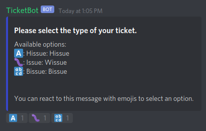
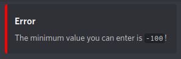
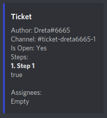

# Ticket Bot

Ticket Bot allows you to easily manage and track tickets. For instance, if you have a Discord server focused on art
commissions, you may want to use tickets for commission requests. Or, if you have a community regarding your game, you
may want to use tickets for reports about cheating.

## Features

* Multiple ticket types. Say for the Discord server of your open-source project, you might want a ticket for issues and
  another for feature requests.

  

* Completely customizable. You can choose between yes/no questions, lists, numbers, selections and lots more. Each step
  type offers a wide range of options, so you can customize them to your needs.

  

  

* Easily manage the ticket by assigning your staff to a ticket.

  

* Extensions. Because I am lazy, and I don't want to add any features, I implemented an extension system so other people
  can do the work for me.

## Build

Ticket Bot builds with Maven 3.

```
mvn package
```

## Extensions

You can check out [Dreta](https://github.com/Dreta)/[**ticketbot-example**](https://github.com/Dreta/ticketbot-example)
for this.

## TODO

- [ ] Extensions that add pre-built ticket step types. I want a step type that parses a GitHub project!
- [ ] Add milestones.
- [ ] Squash bugs.

## License

```
Ticket Bot allows you to easily manage and track tickets.
Copyright (C) 2021 Dreta

Ticket Bot is free software: you can redistribute it and/or modify
it under the terms of the GNU General Public License as published by
the Free Software Foundation, either version 3 of the License, or
(at your option) any later version.

Ticket Bot is distributed in the hope that it will be useful,
but WITHOUT ANY WARRANTY; without even the implied warranty of
MERCHANTABILITY or FITNESS FOR A PARTICULAR PURPOSE.  See the
GNU General Public License for more details.

You should have received a copy of the GNU General Public License
along with Ticket Bot.  If not, see <https://www.gnu.org/licenses/>.
```

## At last

<a href="https://patreon.com/Dreta">
If you want to, please buy me a cup o' coffee!</a>
